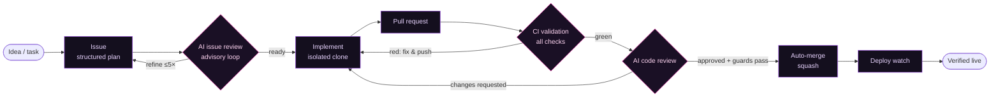
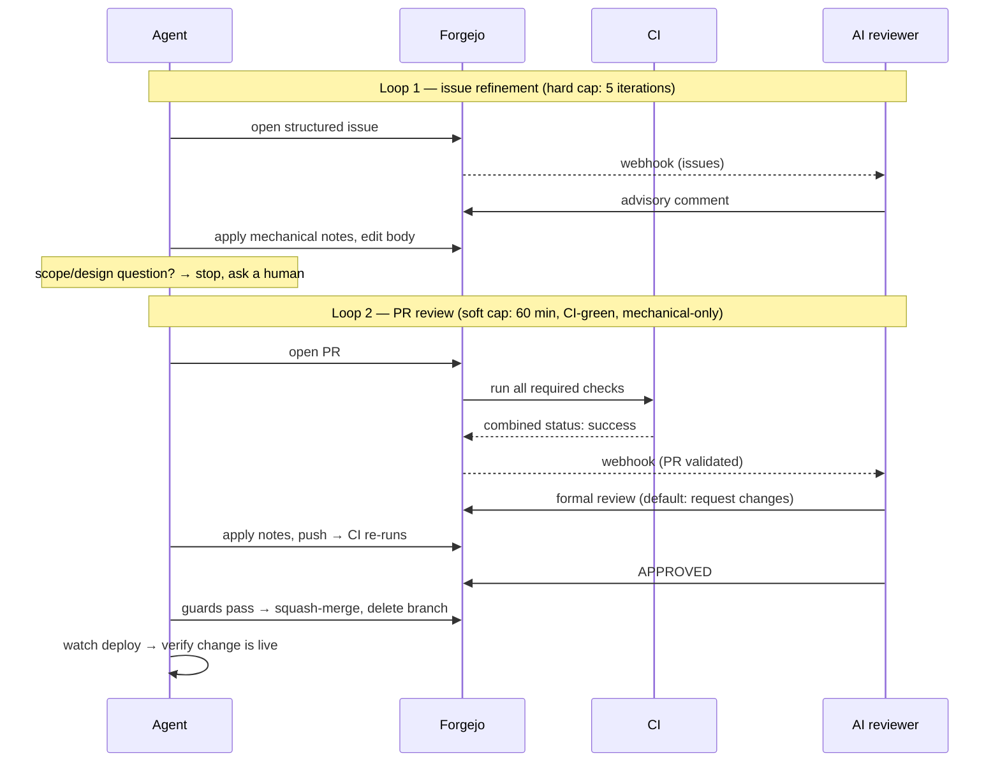
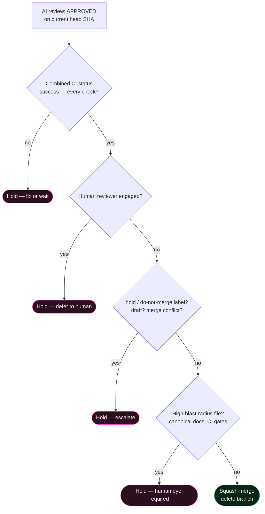
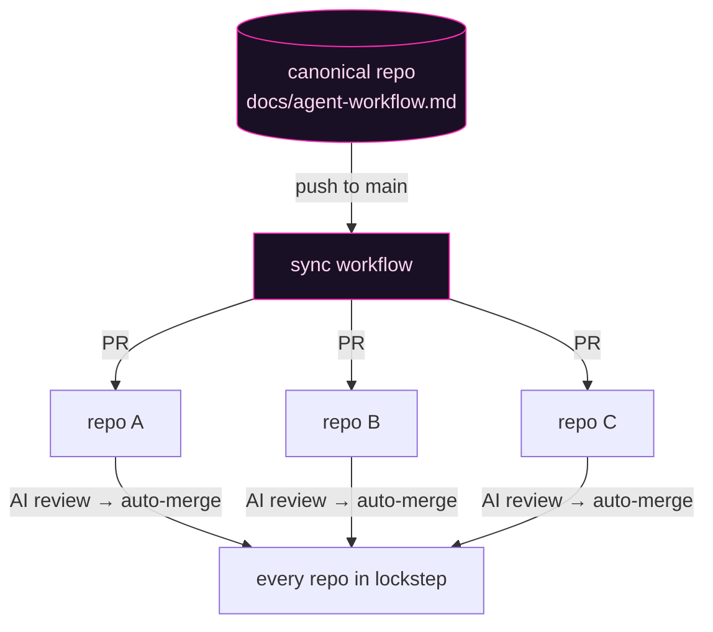

# forgehand

**An autonomous AI development harness for Forgejo.**

Coding agents plan work in issues, an AI reviewer sanity-checks the plan, the agent implements in an isolated checkout, the reviewer gates the pull request, approved PRs merge themselves — and the deploy is watched until the change is verified live.

No human in the happy path. Humans own the overrides.

## Why

- **Review latency, not typing speed, is the bottleneck** once agents write the code. An always-on AI reviewer turns days of round-trips into minutes.
- **Autonomy needs rails, not trust.** Every loop here is capped, every merge is guarded, and every hand-off is monitored — the agent never fires-and-forgets.
- **A merge is not a ship.** The pipeline ends at "verified live", not at "PR merged".

## The two loops

The harness runs two nested review loops — one advisory (issues), one gating (PRs):

## Auto-merge, guarded

Approval alone never merges. The agent merges only when **every** guard holds — and escalates to a human when any fails:

## What's in the box

**forgehand v1 is a reference specification + template bundle, not a turnkey system.** Every artifact carries a disposition: **runnable** (works as shipped), **template** (fill the placeholders, bring your infra), or **contract** (documents an interface you implement — notably the reviewer runtime itself, which stays yours).

| Path | Disposition | What it is |
|---|---|---|
| [`docs/agent-workflow.md`](docs/agent-workflow.md) | template | **The canonical workflow doc** — issue shape, labels, both review loops, the auto-merge guard list, deploy watch. Agents load it at session start. |
| [`docs/reviewer-bot.md`](docs/reviewer-bot.md) | contract | The webhook contract for the AI reviewer: events, identities, idempotency markers, review semantics. |
| [`docs/setup.md`](docs/setup.md) | — | Adoption guide — bot accounts, labels, webhooks, runner, secrets, compatibility floor. |
| [`prompts/issue-review.md`](prompts/issue-review.md) | template | Prompt: advisory issue sanity-check reviewer. |
| [`prompts/pr-review.md`](prompts/pr-review.md) | template | Prompt: gating PR reviewer. |
| [`prompts/nightly-audit.md`](prompts/nightly-audit.md) | contract | Read-only nightly repo auditor prompt + the JSON findings schema its host wrapper must enforce. |
| [`bin/agentwork`](bin/agentwork) | **runnable** | Isolated per-issue checkout helper — one throwaway clone per issue, guarded teardown. |
| [`bin/reviewer-trigger`](bin/reviewer-trigger) | **runnable** | Re-emits a validated PR event to the reviewer, re-signed — run from a **trusted** subscriber/dispatcher, never from PR-controlled CI (see [`docs/reviewer-bot.md`](docs/reviewer-bot.md)). |
| [`.forgejo/workflows/pr-validate.yml`](.forgejo/workflows/pr-validate.yml) | **runnable** | This repo's own live CI gate (markdown/shell/YAML sanity + behavioral smokes + public-surface leak check). Holds **no secrets** by design — it runs PR-head code. Doubles as the validation-gate example. |
| [`workflows/sync-canonical-docs.yml`](workflows/sync-canonical-docs.yml) | template | Forgejo Actions template: cascade the canonical doc into every repo as a PR. |
| [`workflows/nightly-maintenance-audit.yml`](workflows/nightly-maintenance-audit.yml) | template | Nightly audit trigger; needs a host-side wrapper you implement against the prompt contract. |
| [`opencode/plugin/opencodeuler.ts`](opencode/plugin/opencodeuler.ts) | **runnable** | A blocking `wait` tool for opencode, so both engines can pace their polling loops. |
| [`CLAUDE.md`](CLAUDE.md) / [`AGENTS.md`](AGENTS.md) | template | How a repo wires the workflow into Claude Code and opencode — this repo eats its own dog food. |
| [`SECURITY.md`](SECURITY.md) | — | Disclosure policy + the security posture notes adopters should read first. |

## One doc, many repos

The workflow doc is written once, in one repo, and cascaded everywhere — per-repo copies are never edited directly:

Each sync lands as a normal PR, so even the plumbing goes through the same review gate.

## Quick start

1. **Create two bot accounts** on your Forgejo: `forge-bot` (automation: opens PRs, syncs docs) and `reviewer-bot` (the AI reviewer identity). Never the same account — the reviewer must be able to ignore its own events.
2. **Copy `docs/agent-workflow.md`** into a canonical repo, search-and-replace the placeholders (`git.example.com`, `acme`, `reviewer-bot`, `forge-bot`), and add the `workflows/sync-canonical-docs.yml` cascade with your repo list.
3. **Create the labels** — one `type:*` set + your `area:*` sets per repo (see [`docs/setup.md`](docs/setup.md) for a script).
4. **Wire the reviewer**: an org-level webhook for `issues` and PR events pointing at whatever runs your LLM (an agent gateway, n8n, a small service — anything that can receive a webhook, read the repo, and call the Forgejo API). Feed it [`prompts/issue-review.md`](prompts/issue-review.md) and [`prompts/pr-review.md`](prompts/pr-review.md).
5. **Install the helper**: `install -m755 bin/agentwork ~/.local/bin/` on the machine your agents run on; set `FORGE_URL`, `FORGE_ORG`, `AGENTWORK_REPOS`.
6. **Point your agents at it**: each repo's `CLAUDE.md` (and `AGENTS.md` symlink) imports the synced `docs/agent-workflow.md`. Both Claude Code and opencode pick it up at session start.
7. **Calibrate the guards** before trusting auto-merge: run a few PRs with a `hold` label, read what the reviewer does, then take the label off.

## Design principles

- **Caps everywhere.** Issue loop: 5 iterations, hard. PR loop: 60 minutes, CI-green, mechanical-notes-only. Two identical failures in a row → stop guessing, ask a human.
- **Mechanical vs. judgment.** Agents apply mechanical review notes autonomously; any scope or design question is a bail condition, always.
- **The reviewer's default vote is "request changes".** That's the design, not failure — most iterations are "apply notes, push again".
- **Escalation is a feature.** Every loop has explicit bail conditions and a defined report back to the human.
- **Less is more.** No speculative feature flags, no scope creep. Ship what the issue says.

## Origin & versioning

This is a **snapshot release** of a working private setup (a Forgejo org where this loop ships real changes daily), scrubbed of site-specific details. It is not a live mirror; it evolves by explicit release, not by cascade. Development happens on the origin Forgejo instance; the GitHub copy is the public distribution point.

## License

[MIT](LICENSE).
