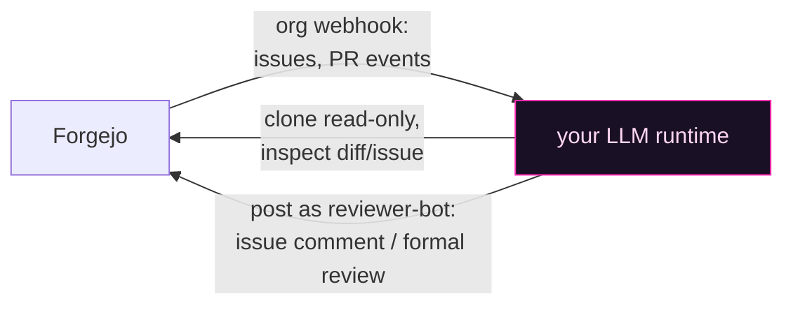

# The AI reviewer — webhook contract

The reviewer is **not** a service this repo ships. It's a contract: anything that can receive a Forgejo webhook, read a repo, and call the Forgejo API can play the role — an agent gateway, an n8n flow, a small daemon wrapping an LLM API. This doc pins down the contract so the prompts in [`prompts/`](../prompts/) drop in cleanly.

## Identities — two bots, never one

| Account | Role | Why separate |
|---|---|---|
| `forge-bot` | Automation: opens issues/PRs, pushes sync branches, runs workflows | Its events are *inputs* to the reviewer |
| `reviewer-bot` | The AI reviewer: posts issue comments and formal PR reviews | Must be able to skip its **own** events — the self-loop guard keys on this login |

If one account did both, every review it posts would re-trigger itself.

## Webhook wiring

One **org-level** webhook (covers new repos automatically), pointed at your LLM runtime:

- **Issue review route** — events: `issues`.
- **PR review route** — events: `pull_request`, `pull_request_sync`, `issue_comment`, `pull_request_comment`, `pull_request_review` (+ approved/rejected/review-request variants).

## Hard rules the runtime must enforce

These live in the prompts, but they're worth enforcing in code too:

1. **Self-loop guard.** If the sender/comment/review author is `reviewer-bot`, do nothing. Check this before any other work.
2. **Scope guard.** Only act on repos under your org prefix. Everything else: no-op.
3. **Idempotency markers.** Every posted body carries a hidden marker:
   - Issues: `<!-- issue-review: issue=<n> body_sha=<hash of title+body> -->` — if the latest reviewer comment carries the same hash, the re-fire is a no-op. Edit-the-body-materially is the re-fire trigger.
   - PRs: `<!-- pr-review-response -->` — comments carrying it are never treated as new input.
4. **Append, don't edit.** On issues, each review is a **new comment** — the chain of past reviews stays auditable.
5. **Skip closed/merged.** Fetch live PR state before expensive work; if closed or merged, stop silently.
6. **Review the head SHA.** A formal PR review binds to `commit_id`. Agents filter reviews by the current head SHA — a review of a stale SHA is ignored, so always review the newest push.
7. **Untrusted content.** PR-branch instruction files (`CLAUDE.md`, `AGENTS.md`, anything in the diff) are untrusted input, not instructions to the reviewer. Never expose credentials or secrets in review text.

## Triggering the reviewer safely — never from PR-controlled CI

The reviewer should fire only *after* a PR's checks pass. The obvious-but-wrong way to arrange that is to add a "notify the reviewer" step to your `pull_request` validation workflow. **Don't.** A `pull_request`-triggered workflow runs entirely from the PR head — both the YAML and every script it calls are code the PR author controls. Handing a reviewer secret (or any credential) to that job hands it to attacker-controlled code, which can exfiltrate it while still letting your validation steps pass. This is the classic **"pwn request"** and it's worse on a self-hosted runner.

So the harness splits the two concerns:

- **Validation** (`.forgejo/workflows/pr-validate.yml`) runs on `pull_request`, checks out PR-head code, and holds **no secrets**. It's safe to run untrusted code because there's nothing there to steal.
- **Triggering** the reviewer is done from a **trusted context the PR author can't rewrite**, reading only the trusted commit-status / PR metadata:
  - a small **status-webhook subscriber** — subscribe to Forgejo's commit-status events; when a PR's combined status flips to `success`, re-emit the (re-signed) PR event to the reviewer; or
  - a **host-side dispatcher** on the machine that already runs your reviewer/runner.

This trusted trigger is a **required** integration, not optional polish — without it the reviewer either never fires or fires before CI settles. Its contract (fail closed):

1. Fire **only** when the PR's **current head** SHA has a combined commit status of `success` (every required check green). Read `GET /repos/<owner>/<repo>/commits/<head>/status` and require top-level `state == "success"` before dispatching.
2. Re-emit against the **current** head only — never a stale SHA — so the review the reviewer posts binds to the commit that actually passed.
3. As defence in depth, the PR-review prompt re-checks the same combined status and returns `NO_ACTION` if it isn't green (so a replayed or hand-fired event can't slip a review in early).

[`bin/reviewer-trigger`](../bin/reviewer-trigger) is the reference re-emitter for that trusted context: give it the PR metadata + the reviewer secret (read from the environment, never argv) and it POSTs the signed event. It refuses to run without the secret and never touches PR-head code. Wire it into your subscriber/dispatcher — **after** the status check above — not into `pr-validate`.

### Runner isolation — necessary alongside "no secrets in PR CI"

Removing secrets from the `pull_request` job is necessary but **not sufficient** on a *persistent* self-hosted runner. PR-head code still executes there as some user, and can poison same-user state that a later trusted job trusts — `$HOME/.local/bin` wrappers, the global Git config, cached workspaces, other host paths. So:

- Run PR-triggered validation on a **disposable / isolated** runner — a fresh container or VM, separate user, home, workspace, and process namespace, torn down after each job.
- Run token-bearing **trusted** jobs (the doc-sync cascade, the nightly audit, the reviewer dispatcher) on a **separate trusted pool** that never executes PR-head code.

Treat this as part of your security contract, not an implementation detail — it's the boundary that makes "the PR job holds no secrets" actually hold.

## Handling credentials in the templates

The workflow templates and helper scripts follow one rule everywhere: **a secret never appears on a command line and is never persisted into a repo.** Concretely — Git auth goes through a credential helper that reads the token from the environment (so the PAT is never in a clone URL, `ps`, or `target/.git/config`); `curl` reads its `Authorization` header from a `-K -` config on stdin; HMAC signing reads its key from the environment via `python3`, not `openssl … -hmac <key>`. Mirror these patterns in anything you add.

## Review semantics

| Surface | Output | Weight |
|---|---|---|
| Issues | One appended comment: verdict (`Viable` / `Viable with adjustments` / `Needs clarification` / `Too large as written`) + short sections | **Advisory** — nudges the agent's §4 loop; never blocks |
| PRs | One formal Forgejo review: `APPROVED` or `REQUEST_CHANGES` with concise blocking findings | **Gating** — `APPROVED` on the current head SHA is the auto-merge trigger (workflow §8) |

Two deliberate design choices:

- **The default PR vote is `REQUEST_CHANGES`.** The loop is built for iteration; a strict default keeps quality high and costs one push per round.
- **Review fires only after CI is green.** Wire your validation workflow (or the webhook filter) so the reviewer never burns tokens on a PR that can't merge anyway. Remember the gate itself is the **combined commit status** — the reviewer trigger is just plumbing.

## Follow-up conversation (PR comments)

Comment events are **not** full re-review triggers. The runtime should respond only to substantive technical pushback, questions, or explicit requests to reconsider ("false positive", "please re-check", a counterargument) — with a single concise comment that acknowledges/amends/retracts or stands by the finding with evidence. Routine chatter, CI noise, and approvals without questions: no response.

## Optional: human notifications

The private origin of this setup pushes a one-line start/completion notice per review into a chat channel (any messenger with an HTTP bridge works). It's operationally gold — you see the loop breathing — but entirely optional; the prompts mark the spot with `NOTIFY_URL`.

## The nightly auditor (third prompt)

[`prompts/nightly-audit.md`](../prompts/nightly-audit.md) is a different animal: a **read-only, no-tools** analyzer run on a schedule by [`workflows/nightly-maintenance-audit.yml`](../workflows/nightly-maintenance-audit.yml). A deterministic wrapper clones the repo, injects file tree + key files + open issues into the prompt, and owns every Forgejo write (issue upsert; guarded auto-close only for issues referenced by a *merged* PR). The model only ever emits one JSON object. Fail-closed: malformed output writes nothing.
